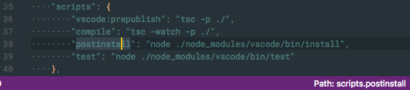

# StatusBar JSONPath

Shows the path to the selected JSON Property in the StatusBar.

## Updates:

* Only shows Path for JSON files.
* StatusBar item now copies to Clipboard - thanks to Tyderion.
* Switched clipboard package - thanks to floatdrop
* Fixed issue with slashes preceeding quotes

## Known Issues

* Only works for JSON files.
